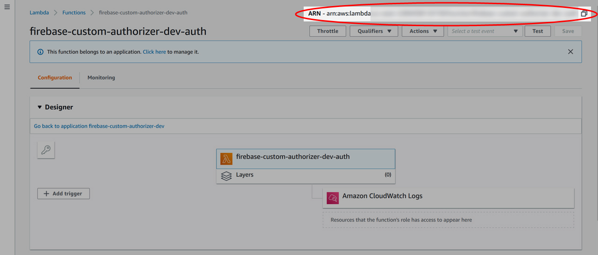
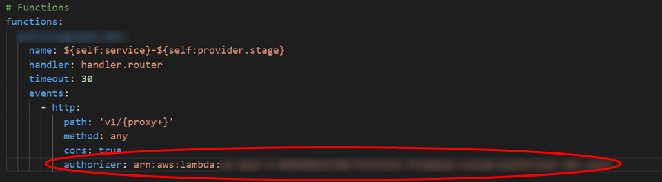

# api-gateway-firebase-auth

Custom (Lambda) authorizer for AWS API Gateway that verifies client authorization tokens generated
by Google Firebase.

## Prerequisites

The following resources are required for using the custom authorizer:

1. A project using the following AWS resources - API Gateway, Lambda
2. Deployment to AWS using the [Serverless framework](https://serverless.com)
3. An IAM user and user profile for your AWS serverless project deployment
4. A Firebase project for authenticating users

## Required files

Two local files need created that contain client secrets. These files are not included in the
repository and must **NOT** be added/committed to the repository.

- An environment.json file that contains information specific to your AWS serverless environment and
  Firebase project. The file, at a minimum requires the following:

```
{
  "AWS_PROFILE": "<your_aws_serverless_deployment_profile>",
  "AWS_REGION": "<your_aws_serverless_deployment_region>",
  "FIREBASE_DATABASE_URL": "<your_firebase_database_URL>"
}
```

- A serviceAccountKey.json file that has the service account keys from your Google Firebase project
  to initialize the firebase-admin SDK. More information about getting the keys and initializing the
  SDK can be found in the
  [official Firebase documentation](https://firebase.google.com/docs/admin/setup#initialize_the_sdk)

## Serverless deployment

If you want a different name for your custom authorizer, change the name in the service property at
the top of the serverless.yml file.

To deploy the custom authorizer to AWS, use the serverless deploy command, which assumes you have
installed the npm serverless package, preferably globally.

```
$ serverless deploy
```

## API Gateway configuration

Configure the API Gateway using the serverless.yml file for your API Lambda function (**NOT** the
custom authorizer serverless.yml in this repository).

First, get the ARN name for the custom authorizer from the AWS Lambda console. It is available in
the upper right corner of the configuration page for the custom authorizer.

Second, add the following like to any path/method where validation of authorization tokens is
required:

```
authorizer: <your_custom_authorizer_ARN>
```

More information about setting up a custom authorizer is available in the
[serverless documentation](https://serverless.com/framework/docs/providers/aws/events/apigateway/#http-endpoints-with-custom-authorizers)

Remember to redploy your API Lambda function after adding the authorizer property to add the
authorization properties to the API Gateway.

Special thanks to the serverless team for putting together
[the example that was used as the basis for this custom authorizer](https://github.com/serverless/examples/tree/master/aws-node-auth0-custom-authorizers-api).

## Additional Information

For additional information and background on why I wrote this custom authorizer, as well as
additional links and information,
[please refer to this article on my blog](https://greggborodaty.com/custom-aka-lambda-authorizer-for-verifying-client-authorization-tokens-generated-by-firebase).

## Constributions

Contributions, ideas, and bug reports are welcome. Please add
[issues](https://github.com/gborodaty/api-gateway-firebase-auth/issues) for suggestions and bug
reports, or create a pull request.

---

### From [The Blog Post](https://greggborodaty.com/custom-aka-lambda-authorizer-for-verifying-client-authorization-tokens-generated-by-firebase/)

In one of my current projects, I am using a serverless setup in AWS for the API. The project uses
[API Gateway](https://aws.amazon.com/api-gateway/) and [Lambda](https://aws.amazon.com/lambda/)
functions. For deployment to AWS, I’m using the [serverless framework](https://serverless.com/),
which helps to streamline the process.

One of the issues I ran into was verifying the client authorization tokens generated by Firebase in
the serverless environment. The brute force approach would have been to verify the token in the
Lambda function for each API microservice I created, but this seemed inefficient. I also found that
adding the [Firebase Admin SDK](https://firebase.google.com/docs/admin/setup) added a lot of heft to
the lambda function. It seemed like there should be a better way, and there is.

The solution for my use case is to use a
[Custom (aka Lambda) Authorizer in the API Gateway](https://docs.aws.amazon.com/apigateway/latest/developerguide/apigateway-use-lambda-authorizer.html)
to validate the client token before passing the request to the Lambda function for handling. This
allows me to have one lambda function that handles the verification of client authorization tokens
for all API routes and methods.

I found some excellent examples of generic Custom Authorizers that use the serverless framework but
had a hard time finding something Firebase specific. Using the
[serverless example of a custom authorizer as a starting point](https://github.com/serverless/examples/tree/master/aws-node-auth0-custom-authorizers-api),
I created a generic custom authorizer that can be setup to work for any project that is sending
client authorization tokens generated by Firebase to the AWS API Gateway.

Here’s information and instructions on using the custom authorizer. The source code is located in
the [Github repository](https://github.com/gborodaty/api-gateway-firebase-auth)

The code is effectively a fork of the excellent sample that the serverless team put together which
can be
[found here](https://github.com/serverless/examples/tree/master/aws-node-auth0-custom-authorizers-api)

## Prerequisites

### Using the custom authorizer assumes the following:

1. You have installed the serverless framework via npm, preferably globally.
2. You have created an
   [IAM user and user profile](https://serverless-stack.com/chapters/customize-the-serverless-iam-policy.html)
   for your AWS serverless project deployment. You can learn more about creating AWS user profiles
   in their
   [documentation](https://docs.aws.amazon.com/cli/latest/userguide/cli-configure-files.html).
   Serverless also has excellent documentation on
   [setting up AWS credentials here](https://serverless.com/framework/docs/providers/aws/guide/credentials/).

```js
// simple IAM Policy for serverless-stack
{
  "Version": "2012-10-17",
  "Statement": [
    {
      "Effect": "Allow",
      "Action": [
        "cloudformation:*",
        "s3:*",
        "logs:*",
        "iam:*",
        "apigateway:*",
        "lambda:*",
        "ec2:DescribeSecurityGroups",
        "ec2:DescribeSubnets",
        "ec2:DescribeVpcs",
        "events:*"
      ],
      "Resource": [
        "*"
      ]
    }
  ]
}
```

3. You are using Firebase to authenticate users and already have a Firebase project created. You can
   [learn more about Firebase projects here](https://firebase.google.com/docs/projects/learn-more).

## Creating the Custom Authorizer

To create a custom authorizer for your API Gateway instance, clone or download the
[custom authorizer GitHub repository](https://github.com/gborodaty/api-gateway-firebase-auth).

Once the files are in your local development area, you will need to create two files, an
`environment.json` and `serviceAccountKey,json`. Here are the contents for each:

- The `environment.json` contains information specific to your AWS serverless environment and is
  used in the serverless.yml configuration file. There’s also some information from the Google
  Firebase project settings that’s used in the function handler. In your IDE, open up the file, and
  put in the following variables:

```json
{
  "AWS_PROFILE": "<your_aws_serverless_deployment_profile>",
  "AWS_REGION": "<your_aws_serverless_deployment_region>",
  "FIREBASE_DATABASE_URL": "<your_firebase_database_URL>"
}
```

- Obtain the `serviceAccountKeys` from Google Firebase for the firebase admin SDK for your project.
  You can follow Google’s
  [documentation here to get your keys](https://firebase.google.com/docs/admin/setup#initialize_the_sdk).
  Once you have the file, move it into the directory and rename it to `serviceAccountKey.json`.

Once you have these files in place, make sure you have them in your .gitignore. You do not want to
commit these to the repository. The repository is already setup to ignore them, so you shouldn’t
have to add them, but it’s worth double-checking to confirm.

Also, if you want to change the name of the custom authorizer service in AWS, be sure to change the
name in the first line of the serverless.yml file.

Once these files are in place, you can deploy the custom authorizer using the serverless deploy
command. The final step is configuring the API Gateway via the serverless framework to use the newly
minted custom authorizer to validate the Firebase generated client authorization tokens.

## Configuring the API Gateway

While you could setup the custom authorizer using the API Gateway console, it is better to use the
serverless framework if you use that to deploy your API microservice Lambda functions.

First, you’ll need to get the ARN for the custom authorizer that you deployed to AWS above. You can
get that by logging into AWS and going to your Lambda functions. Find the name for your custom
authorizer, click on it, and grab the entire ARN in the upper right corner of the screen.



## AWS Lambda Function console

Then go to the serverless configuration file that is used to deploy the API Lambda function (this is
not the custom authorizer serverless.yml file). For any http path and/or method that you want to
validate a Firebase client generated token on, just add the authorizer property with the ARN name
for you custom authorizer.



Once your serverless.yml has been updated, deploy your API using serverless. When you check the API
Gateway, you will see that authorization has been added to all the methods and paths where you have
added the authorizer property. The API requests will be checked for an Authorization header, and the
client tokens will be sent to Firebase for validation.

The API Gateway will return messages to the client for authorization failures. Otherwise, if the
authorization is validated, API Gateway passes on the results, along with the request and associated
payload, to your API Lambda function for further processing.

Here are some additional resources that may be useful if you run into any issues during the
creation, deployment, or processing of responses from the API Gateway:

- [Serverless documentation for custom authorizers](https://serverless.com/framework/docs/providers/aws/events/apigateway/#http-endpoints-with-custom-authorizers)
- Background information on
  [when, and when not, to use custom authorizers](https://www.alexdebrie.com/posts/lambda-custom-authorizers)
- Configuring
  [custom responses from API Gateway](https://github.com/SeptiyanAndika/serverless-custom-authorizer)
